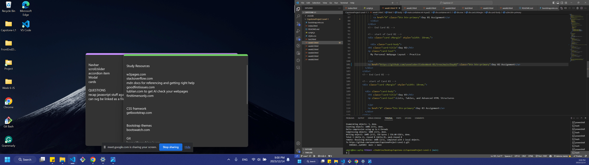

# Capstone Project Title
Umar Zafar Portfolio
## Project Description

Creating my Portfolio relectinng my learning journey at CodeX Academy using different skills learned in the class, using HTML, CSS, Bootstrap, and JavaScript. Also using Git and Github for colaboration purposes to keep track of my progress.

---

## Problem Statement

This portfolio is designed in a way that potential clients and employers can see my progress and understanding about the front-end development

---

## Daily Reflections

### Day 1: [12/11/2023]

#### Today's Progress
- Created repository on github, cloned it. created nessesary html CSS and JS files. Created basic infrastructure of the page including landing page and linked pages.
Done with ACP.

#### Challenges and Blockers
- Had some thought process to come up with a workable idea on how to develop a portfolio.Encounered couple of chalenges regarding implementing an idea incorporating Hover option.Streamlined all the resources required to initiate the project.

#### Learning and Insights
- 
#### Next Steps
- Will start populating linked pages with information

---

### Day 2: [12/12/2023]

#### Today's Progress
Added some functionality to home page. properly linked all 6 pages and added required  card elements to them. Added relevant logos on the pages. fixed sizing and  positioning of the elements.
Done with ACP
#### Challenges and Blockers

Had trouble with the mouse over option to incrase the size of the icons which I fixed today.

#### Learning and Insights
Learned to get proper help from AI tools such as Chat GPT and BARD.

#### Next Steps
Will add social media links to the home page. will create Github repositories to upload all my work to Github and link it to the pages in my portfolio.

---

### Day 3: [12/13/2023]
#### Today's Progress
fixed functionality issues of Icons overlaping other elements by defining width and height for them, fixed sizing and positioning of the elements for different screen sizes.
Added social media links in the navBar
Done with ACP
#### Challenges and Blockers

Had trouble with the mouse over option to incrase the size of the icons which was fixed yesterday yet it still had some overlapping issue on different screen sizes which was fixed today.

#### Learning and Insights
Got help from AI to format the code and resolve potential bugs. 

#### Next Steps
Github repositories still need to be created to upload all my work to Github and link it to the pages in my portfolio.

---

### Day 4: [12/14/2023]
#### Today's Progress
added contact form to main page.
added github icon for navigation to my github profile.
improved functionality of the page with cosmetic changes.
fixed description on cards representing different weeks of my progress and learning.
created required Github repositories for week 01 and 02
Done with ACP
#### Challenges and Blockers
Nothing so far for the day

#### Next Steps
Need to create all necessary repositories in github to link with relative pages on the portfolio

---

### Day 5: [12/15/2023]
#### Today's Progress
Done creating all repositories to link with portfolio pages
linked all relevant repositories to their respective pages
linked week 5 and 6 directly from github to their existing repositories.
Made some cosmetic chages to the Intro section of homepage.
checked all the links on all pages for functionality.
Done ACP as many times needed to keep everything updated

---

## Final Reflection
- Overview of the entire project experience.
My capstone project was a huge opertunity for me to apply all the skills learned so far and to overcome the challenges to complete the project. obstacles only enhanced my overall understanding and ability to deal with blockers succesfully. I was able to present my own ideas on the project.
- Personal growth and learnings.

All the brainstorming and effort to overcome challenges to finish the capstone project helped me further improve my skills and made me feel more confident upon its completion.
Helped paved path for me to learn new skills easily in future, 

---

## Attribution

- To complete this capstone project I got help from my teacher/TA whenever it was necessary. Along the path I also used Open-source libraries such as MDN Docs, Google and used AI tools to check code for errors and formatting issues as needed
used Unsplash image to populate homepage with Display Picture

---

### Usage
Portfolio page is simple enough to navigate easily for all users yet it has all the necessary information about my learning path and skill development.

---

**Note to Students:** Be sure to update this README daily with your reflections and maintain it as a living document throughout your project. This file not only serves as a diary of your progress but also as a comprehensive overview of your capstone project for anyone who visits your repository.
